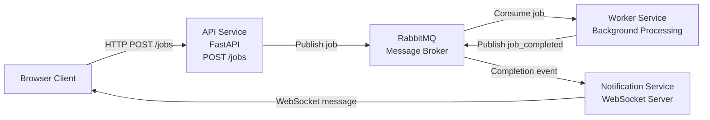

# Async Job Pipeline Demo

A minimal **background asynchronous processing pipeline** built with:

* FastAPI
* RabbitMQ
* WebSockets
* Background workers

This project demonstrates a **common architecture pattern used in modern backend systems** where long-running tasks must be processed asynchronously while the user receives updates in real time.

# High-Level Flow



The user immediately receives a **job ID** and is later notified when the job finishes.

---

# Architecture Diagram

```
                 +------------------+
                 |     Browser      |
                 |                  |
                 |  WebSocket       |
                 |  connection      |
                 +--------+---------+
                          |
                          |
                          v
                 +------------------+
                 | Notification     |
                 | Service          |
                 | (WebSocket)      |
                 +--------+---------+
                          ^
                          |
                          | job_completed event
                          |
                 +--------+---------+
                 |     RabbitMQ     |
                 |     Message      |
                 |     Broker       |
                 +--------+---------+
                          ^
                          |
                          | new job
                          |
                 +--------+---------+
                 | API Service      |
                 | (FastAPI)        |
                 +--------+---------+
                          |
                          |
                          v
                 +------------------+
                 | Worker Service   |
                 | Background Jobs  |
                 +------------------+
```

---

# Components

## 1. Browser Client

The browser:

* opens a **WebSocket connection**
* creates jobs via HTTP
* receives real-time updates when the job finishes

Example:

```
Create Job → receive job_id
Wait → receive WebSocket notification
```

Each browser gets a **UUID client ID** so the system knows which user to notify.

---

## 2. API Service

Built with FastAPI.

Responsibilities:

* receives job creation requests
* generates a `job_id`
* sends the job to the queue

Example request:

```
POST /jobs
```

Response:

```
{
  "job_id": "abc123"
}
```

The API **does not execute the job itself**.

Instead it publishes a message to RabbitMQ.

---

## 3. Message Broker

RabbitMQ allows services to communicate asynchronously. Three queues are used:

```
stage1_jobs
stage2_jobs
job_completed
```

Message example:

```
{
  "job_id": "123",
  "client_id": "uuid"
}
```

Benefits:

* decouples services
* enables horizontal scaling
* buffers workload spikes

---

## 4. Worker 1 Service

The worker consumes messages from the `stage1_jobs` queue.

Example flow:

```
receive job
process task
publish completion event
```

The workers simulates a long-running operation such as:

* LLM request
* image rendering
* data processing

When done, it publishes:

```
{
  "job_id": "...",
  "client_id": "..."
}
```

to the `stage2_jobs` queue.

---

## 4. Worker 2 Service

The worker consumes messages from the `stage2_jobs` queue.

Example flow:

```
receive job
process task
publish completion event
```

When done, it publishes:

```
{
  "job_id": "...",
  "client_id": "..."
}
```

to the `job_completed` queue.

---


## 5. Notification Service

This service maintains **WebSocket connections** with clients.

When a job finishes:

```
RabbitMQ → Notification Service → WebSocket → Browser
```

It sends the result to the **correct client** using the stored `client_id`. This avoids broadcasting events to all users.

---

# Example End-to-End Flow

```
User clicks "Create Job"
        │
        ▼
POST /jobs
        │
        ▼
API publishes job → RabbitMQ
        │
        ▼
Worker receives job
        │
        ▼
Worker finishes task
        │
        ▼
Worker publishes job_completed
        │
        ▼
Notification service receives event
        │
        ▼
WebSocket sends message to client
        │
        ▼
Browser prints:
"Job 123 completed"
```

---

This pattern is used widely in production systems such as:

### LLM systems

```
User → prompt
Worker → call LLM
Notify user when answer ready
```

### Video rendering

```
Upload video
Render in background
Notify when ready
```

### Image generation

```
User prompt
Stable diffusion worker
Notify when image ready
```

### Data analytics

```
User starts report
Worker crunches data
Notify when report finished
```

---

# Advantages of the Pattern

### Non-blocking APIs

HTTP requests return immediately.

---

### Scalable workers

Workers can be scaled horizontally:

```
worker x1
worker x5
worker x50
```

---

### Decoupled services

Services communicate via events instead of direct calls.

---

### Real-time updates

WebSockets allow instant feedback to users.


# The End
If you found this useful, please consider starring the repo on GitHub! ⭐